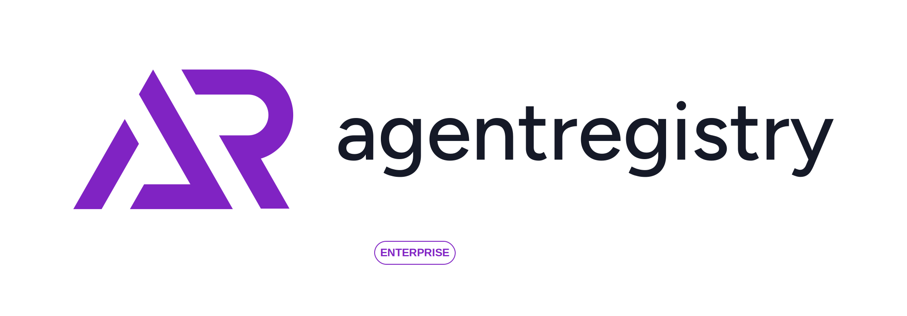

<div align="center">
  <picture>
    
  </picture>

  [](https://golang.org/doc/install)
  [](LICENSE)
  [](https://github.com/agentregistry-dev/agentregistry)
  [](https://discord.gg/HTYNjF2y2t)

  ### A Kubernetes-native registry to securely curate, discover, deploy, and manage agentic infrastructure — MCP servers, agents, skills, and models.
</div>

---

## 🚀 Quick Start

```bash
git clone https://github.com/agentregistry-dev/agentregistry.git
cd agentregistry
make dev
```

UI at `http://localhost:3000` with sample data. 

Uses envtest (embedded etcd + kube-apiserver) — no real cluster needed.

---

## What is Agent Registry?

A **Kubernetes controller** that brings governance and control to AI infrastructure. Teams publish, discover, and deploy AI artifacts as Kubernetes CRDs — with a web UI, REST API, auto-discovery, and multi-cluster support out of the box.

| Feature | Description |
|---|---|
| ☸️ Kubernetes-Native | CRD-based storage, controller-runtime |
| 📦 Centralized Catalog | MCP servers, agents, skills, models in one place |
| 🔒 Review & Approval | GitOps workflow with pending_review → approve/reject |
| 📊 Auto-Discovery | Automatically indexes deployed resources |
| 🌐 Multi-Cluster | Discover across clusters with workload identity |
| 🚀 One-click Deploy | Deploy from catalog to K8s via UI or API |

## 💼 How It Works

### Operator Workflow

<div align="center">
  
</div>

### Developer Workflow

<div align="center">
  
</div>

### GitOps Approval

Submit in UI → manifest generated → GitHub PR → CI/CD creates resource in `pending_review` → team approves in Inventory.

### Multi-Cluster Discovery

Define clusters in a `DiscoveryConfig` CR → workload identity auth → resources auto-cataloged across dev/staging/prod. See [Autodiscovery docs](docs/AUTODISCOVERY.md).

## 🏗️ Architecture

```
┌─────────────────────┐
│   Web UI (Next.js)  │  :3000
└──────────┬──────────┘
           │ HTTP
           ▼
┌─────────────────────┐
│   Controller        │  :8080  HTTP API
│   9 Reconcilers     │  :8081  Metrics
└──────────┬──────────┘  :8082  Health
           │ K8s API
           ▼
┌─────────────────────┐
│ CRDs                │
│  MCPServerCatalog   │
│  AgentCatalog       │
│  SkillCatalog       │
│  RegistryDeployment │
│  DiscoveryConfig    │
└─────────────────────┘
```

## 📚 CRD Reference

### Catalog

```yaml
apiVersion: agentregistry.dev/v1alpha1
kind: MCPServerCatalog          # also: AgentCatalog, SkillCatalog, ModelCatalog
metadata:
  name: filesystem-v1-0-0
  namespace: agentregistry
spec:
  name: "filesystem"
  version: "1.0.0"
  title: "Filesystem MCP Server"
  description: "Provides file system access tools"
  packages:
    - registryType: npm
      identifier: "@modelcontextprotocol/server-filesystem"
      version: "0.6.1"
      transport:
        type: stdio
```

### Deploy

```yaml
apiVersion: agentregistry.dev/v1alpha1
kind: RegistryDeployment
metadata:
  name: filesystem-deployment
  namespace: agentregistry
spec:
  resourceName: "filesystem"
  version: "1.0.0"
  resourceType: mcp             # mcp | agent | skill
  namespace: default            # target namespace
```

Controller looks up the catalog entry, creates the runtime CR (MCPServer/Agent), and tracks status.

### Multi-Cluster Discovery

```yaml
apiVersion: agentregistry.dev/v1alpha1
kind: DiscoveryConfig
metadata:
  name: multi-cluster-discovery
  namespace: agentregistry
spec:
  environments:
    - name: dev
      cluster:
        name: dev-cluster
        projectId: my-gcp-project
        zone: us-central1
        useWorkloadIdentity: true
      provider: gcp
      namespaces: [default, ai-workloads]
      resourceTypes: [MCPServer, Agent, ModelConfig]
      labels:
        environment: dev
```

See [Multi-Cluster Autodiscovery](docs/AUTODISCOVERY.md) for full docs.

## 🔌 API

### Public (read-only)

```bash
curl http://localhost:8080/v0/servers
curl http://localhost:8080/v0/servers/filesystem/1.0.0
curl http://localhost:8080/v0/agents
curl http://localhost:8080/v0/skills
curl http://localhost:8080/v0/models
```

### Admin

```bash
curl -X POST http://localhost:8080/admin/v0/servers -H "Content-Type: application/json" -d @server.json

curl -X POST http://localhost:8080/admin/v0/deploy -H "Content-Type: application/json" \
  -d '{"resourceName":"filesystem","version":"1.0.0","resourceType":"mcp"}'
```

## ☸️ Production

```bash
helm install agentregistry ./charts/agentregistry \
  --namespace agentregistry \
  --create-namespace \
  --set replicaCount=2
```

CRDs are bundled in the chart. Key `values.yaml` knobs:

| Setting | Default | Description |
|---|---|---|
| `replicaCount` | 1 | Set to 2+ for HA |
| `controller.leaderElection` | true | Required for multi-replica |
| `controller.logLevel` | info | debug \| info \| warn \| error |
| `httpApi.port` | 8080 | HTTP API port |
| `httpApi.serviceType` | ClusterIP | ClusterIP \| LoadBalancer \| NodePort |

## 🧪 Development

```bash
make dev          # controller + UI with sample data
make dev-ui       # UI only (hot reload)
make test         # tests with coverage
make lint         # gofmt + go vet
make build        # build binary
make image        # build container image
```

See [`DEVELOPMENT.md`](DEVELOPMENT.md) for details.

## 🔗 Ecosystem

- [Model Context Protocol](https://modelcontextprotocol.io/) — the protocol
- [kagent](https://github.com/kagent-dev/kagent) — Kubernetes AI agent runtime
- [kmcp](https://github.com/kagent-dev/kmcp) — MCP server operator
- [MCP Go SDK](https://github.com/modelcontextprotocol/go-sdk) — official SDK

## 📄 License

MIT — see [`LICENSE`](LICENSE).
