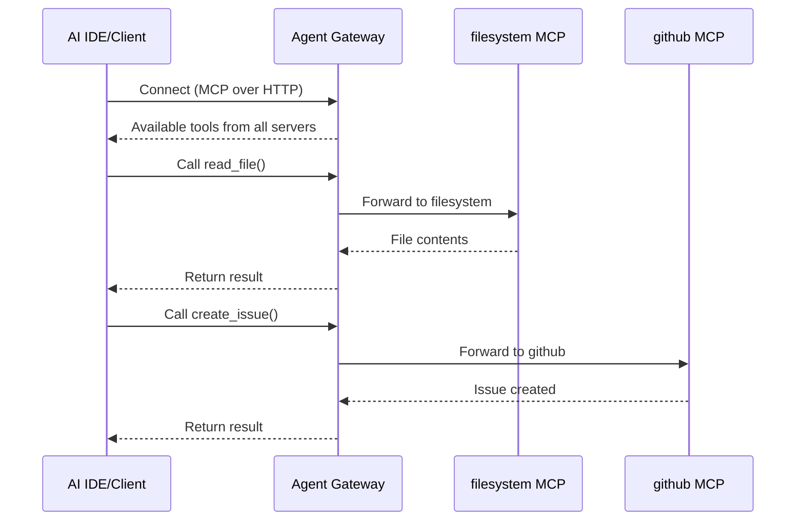

<div align="center">
  <picture>
    
  </picture>
  
  [](https://golang.org/doc/install)
  [](LICENSE)
  [](https://discord.gg/HTYNjF2y2t)
  
  ### A centralized registry to securely curate, discover, deploy, and manage agentic infrastructure from MCP servers, agents to skills.
</div>


##  What is Agent Registry?

Agent Registry brings governance and control to AI artifacts and infrastructure, empowering developers to quickly build and deploy AI applications with confidence. It provides a secure, centralized registry where teams can publish, discover, and share AI artifacts, including MCP servers, agents, and skills, and deploy them seamlessly to any environment.


### Agent Registry provides:

- **📦 Centralized Registry**: Package, discover and curate AI artifacts from a central source
- **🔒 Control and Governance**: Selectively  and control custom collection of artifacts
- **📊 Data Enrichment**: Automatically validate and score ingested data for insights
- **🌐 Unify AI Infrastructure**: Deploy and access artifacts anywhere


## See it in action

Learn how to create an Anthropic Skill, publish it to agentregistry, and use it in Claude Code

[](https://www.youtube.com/watch?v=l6QicyGg46A)

##  Agent Registry Architecture

### For Operators:  Enrich, package, curate and deploy with control


### For Developers: Build, push, pull and run applications with confidence


### Development setup

See [`DEVELOPMENT.md`](DEVELOPMENT.md) for detailed architecture information.

## 🚀 Quick Start

### Prerequisites

- Docker Desktop
- Go 1.25+ (for building from source)
- Kubernetes cluster (for deployment)

### Installation

```bash
# Install via script (recommended)
curl -fsSL https://raw.githubusercontent.com/agentregistry-dev/agentregistry/main/scripts/get-arctl | bash

# Or download binary directly from releases
# https://github.com/agentregistry-dev/agentregistry/releases
```

### Start the Registry

```bash
# Start the registry server and look for available MCP servers
arctl mcp list

# The first time the CLI runs, it will automatically start the registry server daemon and import the built-in seed data.
```


### Access the Web UI

To access the UI, open `http://localhost:12121` in your browser.

## ☸️ Kubernetes Deployment

Agent Registry can be deployed as a Kubernetes controller using Helm. This provides a production-ready setup with CRD-based storage and controller-runtime integration.

### Prerequisites

- Kubernetes cluster (1.27+)
- kubectl configured to access your cluster
- Helm 3.x

### Installation

```bash
# Add the Helm repository (if published) or install from local chart
helm install agentregistry ./charts/agentregistry \
  --namespace agentregistry \
  --create-namespace

# Verify the deployment
kubectl get pods -n agentregistry
kubectl get mcpservercatalogs,agentcatalogs,skillcatalogs -n agentregistry
```

### Configuration

Key configuration options in `values.yaml`:

```yaml
# Controller settings
controller:
  leaderElection: true    # Enable for HA deployments

# HTTP API server
httpApi:
  enabled: true
  port: 8080

# CRD installation
crds:
  install: true
```

### Accessing the API

```bash
# Port-forward to access the API locally
kubectl port-forward -n agentregistry svc/agentregistry 8080:8080

# List servers via API
curl http://localhost:8080/v0/servers
```

### Creating Catalog Entries

Create catalog entries using CRDs:

```yaml
apiVersion: agentregistry.dev/v1alpha1
kind: MCPServerCatalog
metadata:
  name: filesystem-v1-0-0
  namespace: agentregistry
spec:
  name: "filesystem"
  version: "1.0.0"
  title: "Filesystem MCP Server"
  description: "Provides file system access tools"
  packages:
    - registryType: npm
      identifier: "@anthropics/mcp-server-filesystem"
      transport:
        type: stdio
```

### Deploying to Runtime

Deploy catalog entries to Kubernetes using RegistryDeployment:

```yaml
apiVersion: agentregistry.dev/v1alpha1
kind: RegistryDeployment
metadata:
  name: filesystem-deployment
  namespace: agentregistry
spec:
  resourceName: "filesystem"
  version: "1.0.0"
  resourceType: mcp
  runtime: kubernetes
```

The controller will create the appropriate KAgent MCPServer CR to deploy the MCP server.

## 📚 Core Concepts

### MCP Servers

MCP (Model Context Protocol) servers provide tools, resources, and prompts to AI agents. They're the building blocks of agent capabilities.

### Agent Gateway

The [Agent Gateway](https://github.com/agentgateway/agentgateway) is a reverse proxy that provides a single MCP endpoint for all deployed servers:



### IDE Configuration

Configure your AI-powered IDEs to use the Agent Gateway:

```bash
# Generate Claude Desktop config
arctl configure claude-desktop

# Generate Cursor config
arctl configure cursor

# Generate VS Code config
arctl configure vscode
```


## 🤝 Get Involved

### Contributing

We welcome contributions! Please see [`CONTRIBUTING.md`](CONTRIBUTING.md) for guidelines.


### Show your support

- 🐛 **Report bugs and issues**: [GitHub Issues](https://github.com/agentregistry-dev/agentregistry/issues)
- 💡 **Suggest new features**: [GitHub Discussions](https://github.com/agentregistry-dev/agentregistry/discussions)
- 🔧 **Submit pull requests**: [GitHub Repository](https://github.com/agentregistry-dev/agentregistry)
- ⭐ **Star the repository**: Show your support on [GitHub](https://github.com/agentregistry-dev/agentregistry)
- 💬 **Join the Conversation**: Join our [Discord Server](https://discord.gg/HTYNjF2y2t)

###  Related Projects

- [Model Context Protocol](https://modelcontextprotocol.io/)
- [kagent](https://github.com/kagent-dev/kagent)
- [MCP Go SDK](https://github.com/modelcontextprotocol/go-sdk)
- [FastMCP](https://github.com/jlowin/fastmcp)

## 📚 Resources

- 📖 [Documentation] Coming Soon!
- 💬 [GitHub Discussions](https://github.com/agentregistry-dev/agentregistry/discussions)
- 🐛 [Issue Tracker](https://github.com/agentregistry-dev/agentregistry/issues)

## 📄 License

MIT License - see [`LICENSE`](LICENSE) for details.

---
